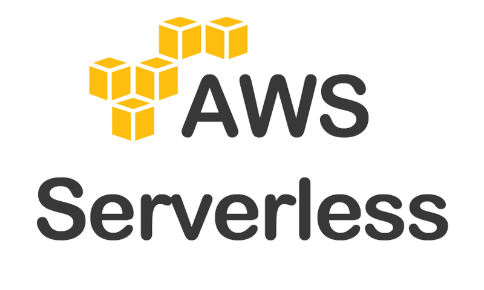

In this tutorial we will be learning about AppSync - Graphql service and i realise that Amplify and Appsync integrates so well.

> Introduction to Amplify and AppSync
> Amplify framework is opensource
> Best practise built-in
> Infrastrcture as code

Amplify Categories
API, STORAGE, NOTIFICATION, AUTH, XR, ANALYTICS
that includes library and clo integrates wilth AWS SERVICES

```
amplify init
amplify add api
amplify mock
amplify push
amplify update api
```

Amplify library api

```
//import amplify components
import { API } from 'aws-amplify'

//call Amazon API Gateway endpoint
const data = await API.get('orderApi', '/orders')
```

> AUTHENTICATION

```
// import React Component
import {withAuthenticator} from 'aws-amplify-react'

// main App component definition
class App extends React.Component{

}
```

> Why AMPLIFY + APPSYNC



> Here is an example of GraphQL Schema:
> Schema consist of base types(data models) and GraphQL operations like query fetching data, mutuation for creating and deleting data; and subscription for changes in real time
> DD

```
# base type
type todo{
    id:ID
    name: String
    completed:Boolean
}
# Query definitions
type Query {
    getTodo(id:ID): Todo
    listTodos: [Todo]
}
# Mutation definitions
type Mutation {
    createTodo(input: Todo): Todo
}

# Subscription definitions
type Subscriptions{
    onCreateTodo: Todo
}
```

# GraphQL Operations

GraphQL Operaions are how you interact with the API data sources. GraphQL operations can be similarly mapped to HTTP methods for RESTFul APIs
GET -> QUERY
PUT -> MUTATIONS
POST -> MUTATIONS
DELETE -> MUTATIONS
PATCH -> MUTATIONS

> AWS APP SYNC
> App Sync is a managed servie that allows us to deploy a GRAPHQL API, resolvers and data sources quickly and easily using the Amplify cli.

# Creating a GRAPHQL API

~ npx create-react-app notesapp
~ cd notesapp
~ npm install aws-amplify antd uuid

~ amplify init
~ amplify add api

Next, Open the base GRAPHQL Schema genereated by cli.
update the schema to the following and save it
