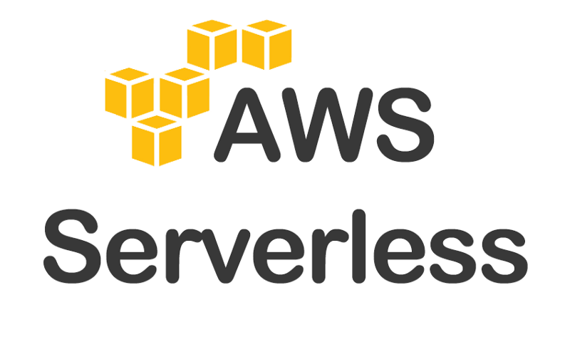

In this tutorial we will be creating a GRAPHQL API that interacts with DYNAMODB NoSQL Database to perform CRUD(Create, Read, Update, Delete and list) Operations.

> Introduction to Graphql
> GRAPHQL is an API Implementation

> What is Graphql
> It is a query language for API's and a runtime for fullfilling those queries with your data.



```
#base type
type todo{
    id:ID
    name: String
    completed:Boolean
}
```
